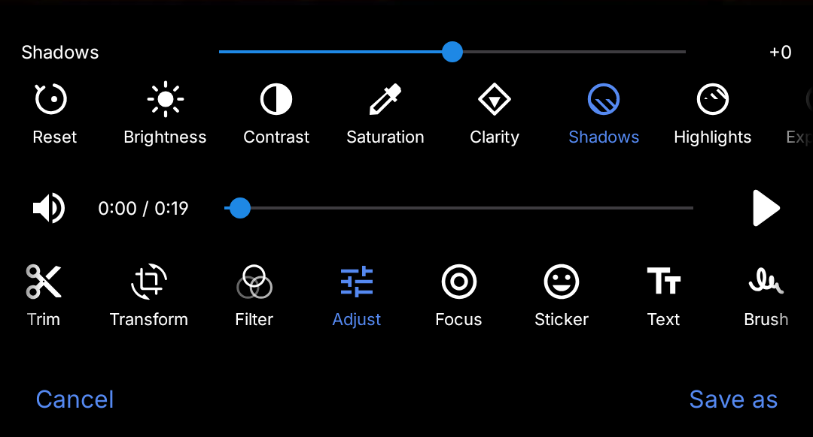

  

# Right Gallery/Alright Gallery
Your private moments are protected. Discover Right Gallery/Alright Gallery, where your privacy is our priority.   
Alright Gallery is a clean, open-source Gallery application built for privacy. No ads. No trackers. No unnecessary permissions. Just fast, reliable media browsing with a fully customizable interface — switch themes, adjust layouts, and make it yours.Your data stays on your device, Always.  
## Added Gallery Strip
This release builds on the original open-source base with custom UI/UX tweaks, introducing an enhanced horizontal gallery strip for faster, more intuitive thumbnail scrubbing. It preserves the core privacy-first foundation—zero ads, zero trackers, and offline data storage—while introducing a polished layout and smoother media viewing experience.

   

## Built-In Editor
This update introduces a clean, in-app media editor, enabling you to crop, rotate, and fine-tune your media files directly within the application without relying on third-party apps. Keeping with the core privacy-first foundation, all media processing happens entirely on your device with zero online data exposure—giving you quick, seamless editing tools while keeping your photos completely private.

